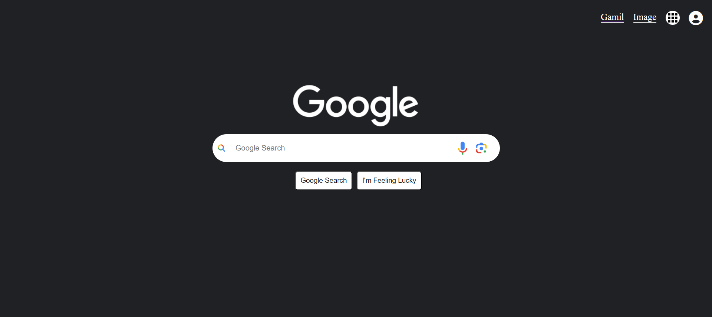

## Live Link: https://rayhan360.github.io/google-clone/ 
# Google Home Page Search Engine Clone

A project that replicates the Google search engine's homepage, providing users with the ability to perform searches and displaying results from Google.

## Introduction

The Google Home Page Search Engine Clone is a project created by cloning the Google search engine's homepage. It allows users to perform searches, and the application will showcase search results directly from Google.

## Features

- Search Functionality: Users can search for anything using the search bar.
- Google Apps Dropdown: The project includes a dropdown section with various Google apps, resembling Google's homepage.

## Usage

To use the Google Home Page Search Engine Clone on your local machine:

1. Clone the repository: `git clone https://github.com/rayhan360/google-clone.git`
2. Navigate to the project directory: `cd google-clone`
3. Open `index.html` in your preferred browser.

Alternatively, you can also try the live demo by clicking [here](https://rayhan360.github.io/google-clone/).

## Built With

This project is built using the following technologies:

- HTML
- CSS
- JavaScript

The search functionality is implemented using Google Search Query URLs.

## Acknowledgments

- This project was inspired by Google's homepage.
